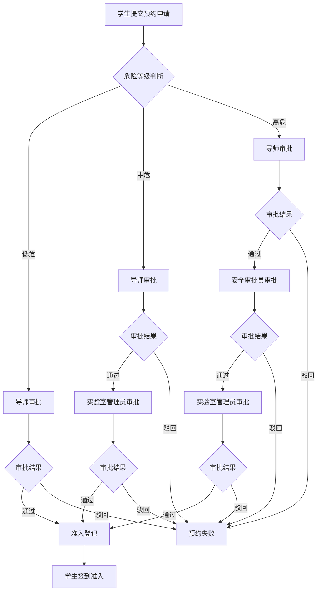

## 1. 产品概述

高校实验室预约管理系统，实现实验台资源数字化管理、周期化排期、条件化分支审批及准入登记全流程闭环。
- 面向高校师生、实验室管理员、导师等多角色，解决预约流程不规范、资源调度混乱、审批路径固化等痛点
- 核心价值：提升实验室资源利用率30%+，审批效率提升50%，实现预约全流程可追溯

## 2. 核心功能

### 2.1 用户角色
| 角色 | 注册方式 | 核心权限 |
|------|----------|----------|
| 学生用户 | 学号注册 | 浏览实验台、提交预约申请、查看审批进度 |
| 导师用户 | 工号注册 | 审批学生预约、查看名下学生预约记录 |
| 实验室管理员 | 管理员创建 | 实验台建档、周期规则配置、时段调整、审批路由配置 |
| 安全审批员 | 管理员创建 | 高危险等级实验的安全审批 |

### 2.2 功能模块
1. **实验台排期模块**：实验台资源建档、排期日历展示、单时段调整、占用状态管理
2. **周期生成模块**：周期规则设定（按周循环）、批量生成未来时段、生成预览与执行
3. **分支审批模块**：条件路由配置（按危险等级匹配）、审批链可视化、动态分支选择
4. **准入登记模块**：预约申请提交、导师审批、安全审批、准入确认登记

### 2.3 页面详情
| 页面名称 | 模块名称 | 功能描述 |
|----------|----------|----------|
| 首页仪表盘 | 数据概览 | 今日预约数、待审批数、实验台使用率统计、快捷入口 |
| 实验台列表 | 实验台排期 | 实验台卡片展示、筛选搜索、详情跳转 |
| 实验台详情 | 实验台排期 | 实验台信息、周排期日历、时段占用状态、单时段编辑 |
| 周期规则配置 | 周期生成 | 规则列表、新建规则（周循环时段）、批量生成预览与执行 |
| 审批路由配置 | 分支审批 | 条件列表（危险等级映射）、审批节点配置、规则启用/禁用 |
| 审批链可视化 | 分支审批 | 图形式展示审批路径、节点状态、当前审批进度 |
| 我的预约 | 准入登记 | 预约列表、新建预约、审批状态追踪、撤销预约 |
| 待我审批 | 准入登记 | 待审批列表、审批操作（通过/驳回）、审批历史 |
| 准入登记 | 准入登记 | 预约确认、准入时间记录、签到登记 |

## 3. 核心流程

学生提交预约申请时，系统根据实验危险等级自动匹配审批路径：低危→导师审批即可准入；中危→导师审批+实验室管理员审批；高危→导师审批+安全审批员+管理员三级审批。审批全流程节点状态可视化展示，审批通过后学生在预约时段签到完成准入登记。

## 4. 用户界面设计

### 4.1 设计风格
- **主色调**：科技蓝 #1890FF（专业可信）、成功绿 #52C41A（审批通过）、警示橙 #FA8C16（中危）、危险红 #F5222D（高危）
- **辅助色**：中性灰系列用于文本与边框，渐变蓝用于头部背景
- **按钮样式**：圆角 6px，主按钮实色填充，次要按钮描边样式，hover 时轻微上浮阴影
- **字体**：思源黑体（Source Han Sans），标题 18-24px 粗体，正文 14px 常规，辅助文字 12px
- **布局风格**：左侧导航栏 + 顶部面包屑 + 主体内容卡片式布局，圆角 8px 卡片配浅阴影
- **图标风格**：线性图标，24px 栅格，色彩与状态绑定（如审批通过用绿色对勾）

### 4.2 页面设计概览
| 页面名称 | 模块名称 | UI元素 |
|----------|----------|--------|
| 首页仪表盘 | 数据概览 | 顶部渐变蓝标题栏、4个统计卡片网格、排期热力图、待办列表 |
| 实验台列表 | 实验台排期 | 搜索筛选栏、实验台卡片网格（状态色标签：空闲绿/占用红/维护黄） |
| 实验台详情 | 实验台排期 | 左侧实验台信息卡、右侧周视图日历（时段色块区分状态）、悬停详情弹窗 |
| 周期规则配置 | 周期生成 | 规则列表表格、抽屉式新建表单（周选择器+时间段多选）、生成进度条 |
| 审批路由配置 | 分支审批 | 危险等级卡片（配色区分）、审批节点拖拽排序、条件表达式编辑器 |
| 审批链可视化 | 分支审批 | 横向流程图布局、节点卡片（状态色边框）、进度连线动画、当前节点高亮脉冲 |
| 我的预约 | 准入登记 | 时间线式预约列表、状态徽章、操作按钮组、详情抽屉 |
| 待我审批 | 准入登记 | 分类Tab（待办/已办）、列表含快捷审批按钮、批量操作栏 |
| 准入登记 | 准入登记 | 预约信息展示卡、签到二维码、签到时间记录、准入确认按钮 |

### 4.3 响应式
- 桌面端优先（1440px基准），适配1280px及以上
- 平板端（768-1024px）：左侧导航折叠为图标，表格支持横向滚动
- 移动端（<768px）：底部Tab导航，卡片单列堆叠，日历简化为列表视图
- 触控优化：按钮最小触控区 44×44px，列表项增加垂直间距

### 4.4 动效设计
- 页面切换：淡入+轻微上移，200ms 缓动
- 审批节点：当前待审批节点脉冲呼吸动画，通过节点绿色勾选渐入
- 时段生成：进度条加载动画，生成完成后成功Toast滑入
- 卡片悬停：阴影加深+1px上移，150ms 过渡
