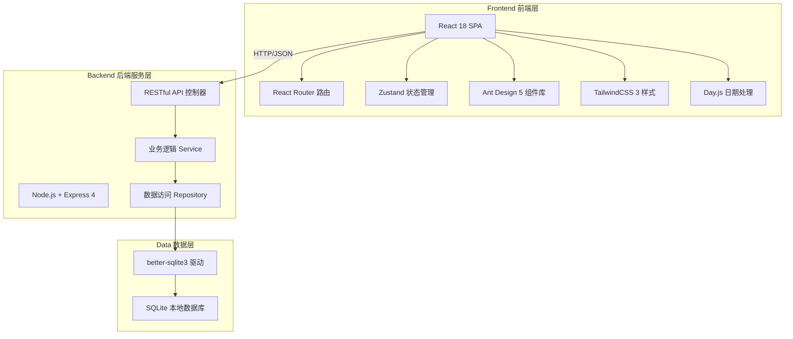
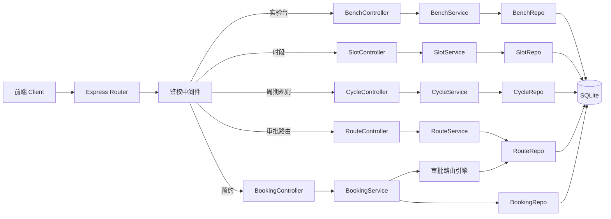
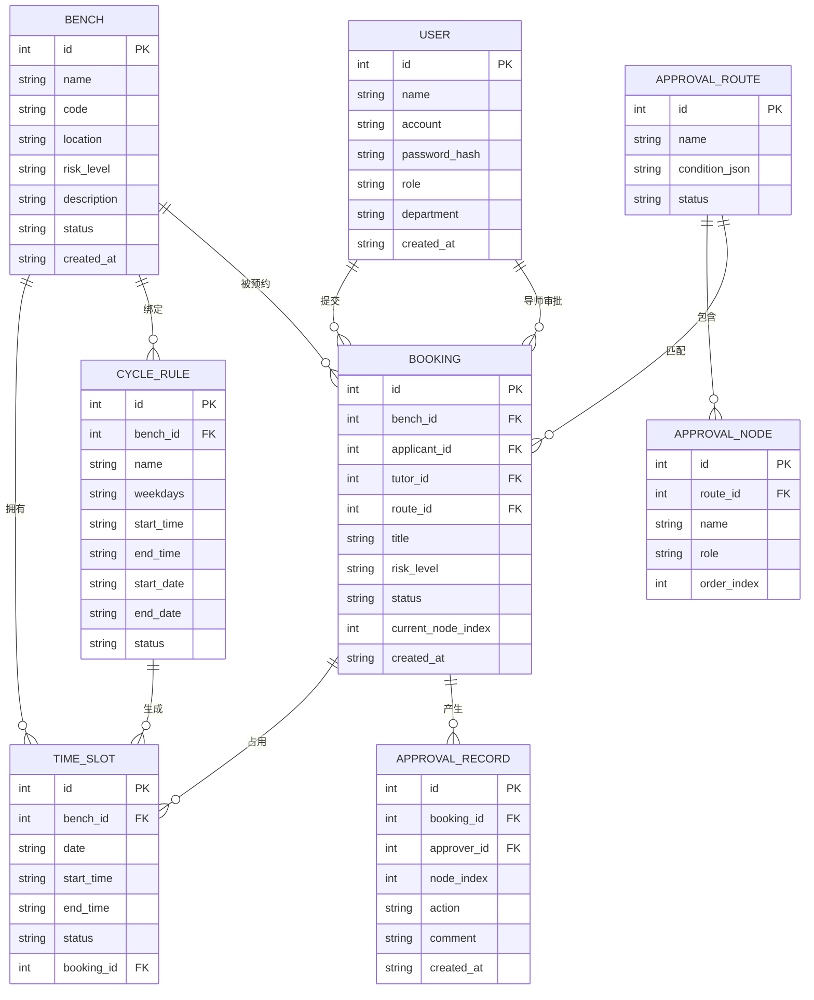

## 1. 架构设计



## 2. 技术描述

- **前端框架**：React 18 + TypeScript + Vite 5 （构建工具）
- **路由管理**：React Router v6.20 （嵌套路由、懒加载）
- **状态管理**：Zustand 4.4 （轻量级、不可变更新）
- **UI组件库**：Ant Design 5.12 （企业级组件、主题定制）
- **样式方案**：TailwindCSS 3.4 （原子化CSS）+ CSS Modules
- **日期处理**：Day.js 1.11 （轻量替代Moment）
- **后端服务**：Node.js 20 + Express 4.18
- **数据库**：SQLite 3 + better-sqlite3 同步驱动（零配置、文件型）
- **API通信**：Fetch API + 自定义拦截器（统一错误处理、Token注入）
- **构建初始化**：Vite 官方 React+TypeScript 模板

## 3. 路由定义

| 路由路径 | 页面组件 | 用途说明 |
|----------|----------|----------|
| /dashboard | DashboardPage | 首页仪表盘、数据概览 |
| /benches | BenchListPage | 实验台列表 |
| /benches/:id | BenchDetailPage | 实验台详情与排期日历 |
| /cycle-rules | CycleRulesPage | 周期规则配置与批量生成 |
| /approval-routes | ApprovalRoutesPage | 审批路由条件配置 |
| /approval-chains/:bookingId | ApprovalChainPage | 审批链可视化展示 |
| /my-bookings | MyBookingsPage | 我的预约列表与新建预约 |
| /to-approve | ToApprovePage | 待我审批列表 |
| /access-checkin | AccessCheckinPage | 准入登记签到 |

## 4. API 定义

```typescript
// 实验台
interface Bench { id: number; name: string; code: string; location: string; riskLevel: 'low'|'medium'|'high'; description: string; status: 'active'|'maintenance'|'disabled'; createdAt: string; }
GET    /api/benches              // 列表（支持筛选）
GET    /api/benches/:id          // 详情
POST   /api/benches              // 新建
PUT    /api/benches/:id          // 更新
DELETE /api/benches/:id          // 删除

// 排期时段
interface TimeSlot { id: number; benchId: number; date: string; startTime: string; endTime: string; status: 'available'|'booked'|'occupied'|'maintenance'; bookingId?: number; }
GET    /api/benches/:id/slots    // 指定实验台某周的时段
PUT    /api/slots/:id            // 调整单个时段
POST   /api/slots/batch          // 批量调整时段

// 周期规则
interface CycleRule { id: number; benchId: number; name: string; weekdays: number[]; startTime: string; endTime: string; startDate: string; endDate: string; status: 'active'|'inactive'; }
GET    /api/cycle-rules          // 规则列表
POST   /api/cycle-rules          // 新建规则
POST   /api/cycle-rules/:id/generate // 执行批量生成时段
DELETE /api/cycle-rules/:id      // 删除规则

// 审批路由配置
interface ApprovalRoute { id: number; name: string; condition: { field: string; op: string; value: any }; nodes: ApprovalNode[]; status: 'active'|'inactive'; }
interface ApprovalNode { id: number; name: string; role: 'tutor'|'safety'|'admin'; order: number; }
GET    /api/approval-routes      // 路由列表
POST   /api/approval-routes      // 新建路由
PUT    /api/approval-routes/:id  // 更新路由
DELETE /api/approval-routes/:id  // 删除路由

// 预约
interface Booking { id: number; benchId: number; slotIds: number[]; applicantId: number; tutorId: number; title: string; riskLevel: 'low'|'medium'|'high'; status: 'pending'|'tutor_approved'|'safety_approved'|'admin_approved'|'approved'|'rejected'|'checked_in'|'cancelled'; currentNodeIndex: number; createdAt: string; }
GET    /api/bookings/mine        // 我的预约
GET    /api/bookings/to-approve  // 待我审批
POST   /api/bookings             // 提交预约申请
POST   /api/bookings/:id/approve // 审批通过
POST   /api/bookings/:id/reject  // 审批驳回
GET    /api/bookings/:id/chain   // 审批链详情

// 准入登记
POST   /api/bookings/:id/checkin // 签到登记
```

## 5. 服务端架构图



## 6. 数据模型

### 6.1 ER 图



### 6.2 DDL 与初始数据

```sql
-- 用户表
CREATE TABLE IF NOT EXISTS users (
    id INTEGER PRIMARY KEY AUTOINCREMENT,
    name TEXT NOT NULL,
    account TEXT UNIQUE NOT NULL,
    password_hash TEXT NOT NULL,
    role TEXT NOT NULL CHECK (role IN ('student','tutor','admin','safety')),
    department TEXT,
    created_at TEXT DEFAULT (datetime('now','localtime'))
);

-- 实验台
CREATE TABLE IF NOT EXISTS benches (
    id INTEGER PRIMARY KEY AUTOINCREMENT,
    name TEXT NOT NULL,
    code TEXT UNIQUE NOT NULL,
    location TEXT NOT NULL,
    risk_level TEXT NOT NULL CHECK (risk_level IN ('low','medium','high')),
    description TEXT,
    status TEXT NOT NULL DEFAULT 'active' CHECK (status IN ('active','maintenance','disabled')),
    created_at TEXT DEFAULT (datetime('now','localtime'))
);

-- 排期时段
CREATE TABLE IF NOT EXISTS time_slots (
    id INTEGER PRIMARY KEY AUTOINCREMENT,
    bench_id INTEGER NOT NULL,
    date TEXT NOT NULL,
    start_time TEXT NOT NULL,
    end_time TEXT NOT NULL,
    status TEXT NOT NULL DEFAULT 'available' CHECK (status IN ('available','booked','occupied','maintenance')),
    booking_id INTEGER,
    FOREIGN KEY (bench_id) REFERENCES benches(id)
);
CREATE INDEX idx_slots_bench_date ON time_slots(bench_id, date);

-- 周期规则
CREATE TABLE IF NOT EXISTS cycle_rules (
    id INTEGER PRIMARY KEY AUTOINCREMENT,
    bench_id INTEGER NOT NULL,
    name TEXT NOT NULL,
    weekdays TEXT NOT NULL,
    start_time TEXT NOT NULL,
    end_time TEXT NOT NULL,
    start_date TEXT NOT NULL,
    end_date TEXT NOT NULL,
    status TEXT NOT NULL DEFAULT 'active',
    FOREIGN KEY (bench_id) REFERENCES benches(id)
);

-- 审批路由
CREATE TABLE IF NOT EXISTS approval_routes (
    id INTEGER PRIMARY KEY AUTOINCREMENT,
    name TEXT NOT NULL,
    condition_json TEXT NOT NULL,
    status TEXT NOT NULL DEFAULT 'active'
);

-- 审批节点
CREATE TABLE IF NOT EXISTS approval_nodes (
    id INTEGER PRIMARY KEY AUTOINCREMENT,
    route_id INTEGER NOT NULL,
    name TEXT NOT NULL,
    role TEXT NOT NULL,
    order_index INTEGER NOT NULL,
    FOREIGN KEY (route_id) REFERENCES approval_routes(id)
);

-- 预约单
CREATE TABLE IF NOT EXISTS bookings (
    id INTEGER PRIMARY KEY AUTOINCREMENT,
    bench_id INTEGER NOT NULL,
    applicant_id INTEGER NOT NULL,
    tutor_id INTEGER NOT NULL,
    route_id INTEGER NOT NULL,
    title TEXT NOT NULL,
    risk_level TEXT NOT NULL,
    status TEXT NOT NULL DEFAULT 'pending',
    current_node_index INTEGER NOT NULL DEFAULT 0,
    created_at TEXT DEFAULT (datetime('now','localtime')),
    FOREIGN KEY (bench_id) REFERENCES benches(id),
    FOREIGN KEY (applicant_id) REFERENCES users(id),
    FOREIGN KEY (tutor_id) REFERENCES users(id),
    FOREIGN KEY (route_id) REFERENCES approval_routes(id)
);

-- 预约-时段 关联
CREATE TABLE IF NOT EXISTS booking_slots (
    booking_id INTEGER NOT NULL,
    slot_id INTEGER NOT NULL,
    PRIMARY KEY (booking_id, slot_id),
    FOREIGN KEY (booking_id) REFERENCES bookings(id),
    FOREIGN KEY (slot_id) REFERENCES time_slots(id)
);

-- 审批记录
CREATE TABLE IF NOT EXISTS approval_records (
    id INTEGER PRIMARY KEY AUTOINCREMENT,
    booking_id INTEGER NOT NULL,
    approver_id INTEGER NOT NULL,
    node_index INTEGER NOT NULL,
    action TEXT NOT NULL CHECK (action IN ('approve','reject')),
    comment TEXT,
    created_at TEXT DEFAULT (datetime('now','localtime')),
    FOREIGN KEY (booking_id) REFERENCES bookings(id),
    FOREIGN KEY (approver_id) REFERENCES users(id)
);

-- 初始数据：测试用户
INSERT INTO users (name, account, password_hash, role, department) VALUES
('张同学', 'stu001', '123456', 'student', '化学学院'),
('李同学', 'stu002', '123456', 'student', '物理学院'),
('王导师', 'tut001', '123456', 'tutor', '化学学院'),
('赵导师', 'tut002', '123456', 'tutor', '物理学院'),
('陈管理员', 'adm001', '123456', 'admin', '实验中心'),
('刘安全员', 'saf001', '123456', 'safety', '安全办公室');

-- 初始实验台
INSERT INTO benches (name, code, location, risk_level, description, status) VALUES
('化学实验台A-01', 'CHEM-A01', '化学楼301-A', 'low', '基础化学实验台，配备常用玻璃仪器', 'active'),
('化学实验台B-02', 'CHEM-B02', '化学楼301-B', 'medium', '有机化学实验台，配备通风橱', 'active'),
('物理实验台P-01', 'PHY-P01', '物理楼201', 'low', '普通物理实验台，配备光学仪器', 'active'),
('生物安全台S-01', 'BIO-S01', '生物楼101', 'high', '生物安全二级实验台，配备生物安全柜', 'active'),
('材料实验台M-01', 'MAT-M01', '材料楼401', 'medium', '材料合成实验台，配备高温炉', 'active');

-- 初始审批路由（按危险等级）
INSERT INTO approval_routes (name, condition_json, status) VALUES
('低危实验审批流程', '{"field":"riskLevel","op":"==","value":"low"}', 'active'),
('中危实验审批流程', '{"field":"riskLevel","op":"==","value":"medium"}', 'active'),
('高危实验审批流程', '{"field":"riskLevel","op":"==","value":"high"}', 'active');

INSERT INTO approval_nodes (route_id, name, role, order_index) VALUES
(1, '导师审批', 'tutor', 1),
(2, '导师审批', 'tutor', 1),
(2, '实验室管理员审批', 'admin', 2),
(3, '导师审批', 'tutor', 1),
(3, '安全审批员审批', 'safety', 2),
(3, '实验室管理员审批', 'admin', 3);
```
